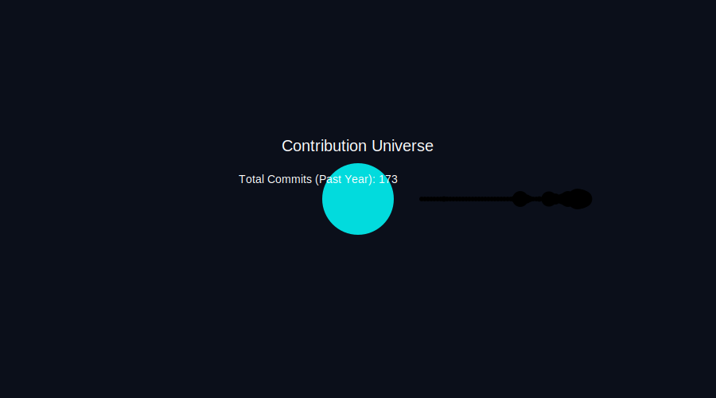

# 💫 About Me:
🌱 Discovery Phase: Constantly experimenting, learning, and reshaping ideas.  🔧 Strengths: Troubleshooting, implementation, and backend integration.  🧩 Philosophy: Magic fades when logic is revealed.  ✨ Identity: Reshapel — decode it to know me.  ⚡ I don’t just use technology—I honor it.

## 🌐 Socials:
    

# 💻 Tech Stack:
                                             

# 📊 GitHub Stats:
 
 

### 📈 Contribution Graph 
### 🔝 Top Contributed Repo

# 🌌 Dev Universe

### ✍️ Random Dev Quote

---

